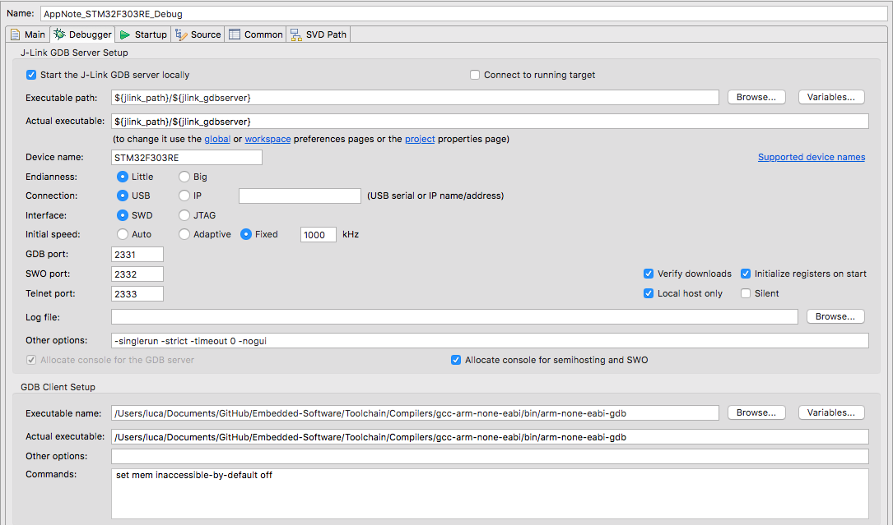

# STM32 BSP - Embedded Project Reference
Complete embedded C\C++ BSP for STM32 microcontrollers.
The idea behind this project is to have a complete reference to build an embedded project based on the ARM GNU toolchain starting from complete scratch. All the files have been written from scratch and are fully documented in order to be easily reused in the future as fast refresh reference.

This project contains a complete embedded application: 

- Boostrap\startup.c file
- Memory layout\Linker script
- Peripheral drivers + demos
- Build system\Make file
- *Python tools for scripting and miscellaneous* (to implement)

The project contain also the configuration files to:
- Use **Visual Studio Code** as main IDE for editing source files.
- Use **Eclipse MCU** as main IDE to debug your application.

Details on configuration are reported in the following sections.

## How to use
This project can be used as the harness to build up a fully customazible project on STM32 microcrontroller from scratch.
#### Compile a project
To build a project it is necessary to customize the *makefile*:
* Define the `$(ROOT)` variable with the path to your toolchain binary folder. 
*You can use a toolchain reported in the [Toolchain](https://github.com/lzzzam/Toolchain) repository.* 
* Define the `$(TARGET)` variable with one of the files in *test* folder.
* Add paths to include or source files in the `$(INC)` and `$(SRC)` *makefile*'s variables if necessary.
* Enter the *src* directory and run `make` command.

#### Debug a project
To debug a project with Eclipse MCU:

After installation and setup of Eclipse MCU, open your project and:
* Right-click on the project directory
* Select *Debug as > Debug Configurations*
* Create a new **GDB Segger J-Link Debugging** session:
  - *Main Tab*: insert *Project* name + *your_target.elf* file as C\C++ application to debug.
  - *Debugger Tab*: 
  
  Insert STM32F303RE as device name and select SWD\JTAG interface.

  **IMPORTANT**
  Select as *GDB Client* the *arm-none-eabi-gdb* binary from the same toolchain folder of the *arm-none-eabi-gcc* compiler.
  This step is mandatore in order to be sure that the debug information inserted into the .elf file insterted during the compilation process can be correctly read and used by the debugger binary. For this reason it is strongly raccomended to use compiler and debugger binary from the same release.

  - *Startup/Source/Common Tabs*: leave default configuration
  - *SVD Path*: insert the file under `STM32F303RE/Conf/STM32F303.svd`
  - Apply and start debug session.

## Setup environment
#### Setup Visual Studio Code 

###### Installation and Extensions
* Download and install Visual Studio Code.
Follow the official [VSC reference guide](https://code.visualstudio.com/docs/editor/codebasics) to learn how to use and setup this IDE.
* Install the following exentions: 
    - **C/C++** by *Microsoft*
    - **C/C++ Extension Pack** by *Microsoft*
    - **C/C++ Themes** by *Microsoft*
    - **CMake** by *twxs*
    - **Arm Assembly** by *dan-c-underwood*
    - **Cortex-Debug** by *marus25*
    - **GitLens** by *GitKraken*
    - **Git Graph** by *mhutchie*
    - **Gnu Linker Map** by *Trond Snekvik*
    - **Python** by *Microsoft*
    - **Pylance** by *Microsoft*
    - **Python Extension Pack** by *Don Jayamanne*
    - **Python Environment Manager** by *Don Jayamanne*
    - **Visual Studio IntelliCode** by *Microsoft*
    - **vscode-icons** by *VSCide Icons Team*
    - **Back & Forth** by *Nick Rudenko*

###### VSC with Git Version Control
Follow the official [VSC setup with Git](https://code.visualstudio.com/docs/editor/versioncontrol) to learn how to use and setup the IDE for Version Control.

The [Official Git Reference Documentation](https://git-scm.com/doc) can guide you through all the usage of git commands.

To complete the configuration make the following:

* Setup VSC as main Git Editor: 
When you launch VS Code from the command line, you can pass the --wait argument to make the launch command wait until you have closed the new VS Code instance. This can be useful when you configure VS Code as your Git external editor so Git will wait until you close the launched VS Code instance.

Here are the steps to do so:
Make sure you can run `code --help` from the command line and you get help.
If you do not see help, please follow these steps:
    - macOS: Select Shell Command: Install 'Code' command in path from the Command Palette.
    - Windows: Make sure you selected Add to PATH during the installation.
    - Linux: Make sure you installed Code via our new .deb or .rpm packages.

From the command line, run `git config --global core.editor "code --wait"`
Now you can run `git config --global -e` and use VS Code as editor for configuring Git.

* Setup VSC as main Git Diff Tool
Add the following to your Git configurations to use VS Code as the diff tool:
```
[diff]
    tool = default-difftool
[difftool "default-difftool"]
    cmd = code --wait --diff $LOCAL $REMOTE
```
Follow this reference to [git config](https://git-scm.com/docs/git-config) to setup your configuration file.

#### Setup Eclipse MCU as IDE for debugging
#### Hardware setup
